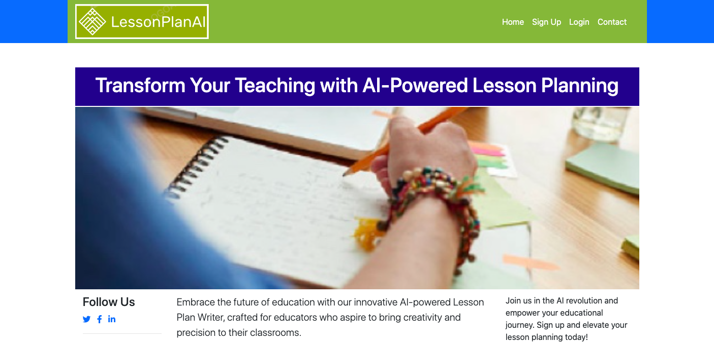

## Lesson PlanAI

Lesson PlanAI is an innovative platform that harnesses the power of cutting-edge artificial intelligence to revolutionize the way educators create lesson plans. Whether you are a seasoned teacher or just starting in the field, Lesson PlanAI empowers you to craft dynamic, personalized, and engaging lesson plans effortlessly.

**Key Features**

<h2>AI-Powered Lesson Generation</h2>
Leverage the capabilities of our advanced AI models to generate rich and contextually relevant lesson content tailored to various subjects and grade levels.

**<h2>Curriculum Alignment** </h2>

Easily align your lesson plans with national or regional curriculum standards to ensure your teaching is in sync with educational guidelines.

Run the application: python manage.py

Visit http://localhost:5000 in your browser to access Lesson PlanAI.

You can also access the application via lessonplanai.pythonanywhere.com

**<h2>Contributing**</h2>
We welcome contributions from the community! If you have ideas for improvement or want to report issues, please submit a pull request or open an issue on the GitHub repository.

License
This project is licensed under the MIT License.

python manage.py create_admin to create admin users